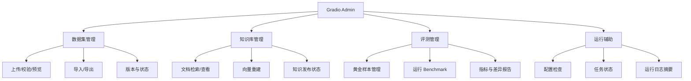
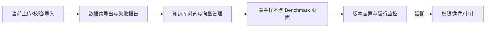

# Gradio Admin 后台规划

Gradio Admin 只负责数据与运行管理，不替代 LangGraph 分析流程，也不在界面中写入部门、公司或城市等业务事实。权限、角色和审计增强暂缓，先保留明确的功能边界。

## 功能地图

## 分阶段功能

| 模块 | MVP | 后续增强 | 当前状态 |
| --- | --- | --- | --- |
| 数据集管理 | 上传 JSONL、选择知识域与专家 Profile、格式校验、草稿/`VERIFIED` 预览、导入 PostgreSQL | 增量导入、重复记录比较、失败行下载 | 已有上传/校验/导入脚本界面 |
| 数据集导出 | 导出规范化 `VERIFIED` JSONL、查看/保存校验失败报告 | 按城市、主题、状态和日期筛选导出 | 已接入 Gradio |
| 数据集版本 | 显示数据集目录和导入摘要 | 版本快照、差异对比、回滚 | 待开发 |
| 知识库管理 | 按类型、主题、来源检索并查看证据片段 | 文档生命周期操作、来源追溯 | 待开发 |
| 向量管理 | 查看向量模型/维度统计、触发重建 | 分批进度、失败重试、模型切换检查 | 已有命令行重建，待接 UI |
| 黄金样本 | 上传/校验评测 JSON、运行 Benchmark | 样本版本、单案例差异查看 | 已有评测器，待接 UI |
| 评测报告 | 展示通过率、证据覆盖、Reviewer 指标 | 趋势比较、模型/权重对比 | 待开发 |
| 运行辅助 | 检查配置是否完整、显示任务结果 | 任务队列、告警与运行指标 | 待开发 |
| 权限与审计 | 暂不实现 | 登录、角色、操作审计、敏感配置脱敏 | 明确延期 |

## 推荐开发顺序

## 设计约束

- 所有导入必须复用 `app.knowledge.dataset.load_dataset`，不能绕过 `VERIFIED` 门槛。
- 导出默认提供 JSONL 和评测报告两类结果，保留 `source_id`、来源 URL 和状态字段。
- 每次上传必须选择知识域（或明确选择整包）和适用专家 Profile；Profile 记录写入文档 metadata，供后续检索隔离。
- Admin 页面只调用已有 service/repository，不在 Gradio callback 内复制业务规则。
- 模型 API Key、数据库密码等敏感配置只显示“已配置/未配置”，不回显原值。
- 权限先记录为延期项，当前版本默认面向受信任的内部开发环境。
