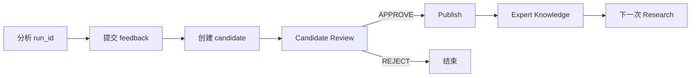

# Expert Engine API 文档

Base URL：`http://localhost:8000`。启动：

```bash
uv run uvicorn app.main:app --host 0.0.0.0 --port 8000
```

Swagger：`GET /docs`；OpenAPI：`GET /openapi.json`。

## 接口总览

| 方法 | 路径 | 用途 |
| --- | --- | --- |
| `POST` | `/api/v1/expert/analyze` | 启动一次 Expert 分析 |
| `GET` | `/api/v1/expert/runs` | 查询最近运行记录和 `run_id` |
| `GET` | `/api/v1/expert/runs/{run_id}` | 获取完整分析结果 |
| `GET` | `/api/v1/expert/runs/{run_id}/events` | 查询节点运行事件 |
| `GET` | `/api/v1/expert/profiles/{expert_id}/capability-report` | 查询 Expert 能力与资料准备度 |
| `POST` | `/api/v1/expert/runs/{run_id}/reviews` | 提交人工复核 |
| `POST` | `/api/v1/expert/runs/{run_id}/feedback` | 记录人工实践反馈 |
| `POST` | `/api/v1/expert/runs/{run_id}/knowledge-candidates` | 从反馈生成知识候选 |
| `GET` | `/api/v1/expert/knowledge-candidates/{candidate_id}` | 查询知识候选 |
| `POST` | `/api/v1/expert/knowledge-candidates/{candidate_id}/reviews` | 审核知识候选 |
| `POST` | `/api/v1/expert/knowledge-candidates/{candidate_id}/publish` | 发布正式专家知识 |
| `POST` | `/api/v1/expert/knowledge-publications/{publication_id}/retire` | 退役知识版本 |
| `POST` | `/api/v1/expert/knowledge-publications/{publication_id}/restore` | 恢复知识版本 |
| `POST` | `/api/v1/knowledge/documents` | 写入一份知识文档 |
| `GET` | `/healthz` | 健康检查 |

## 1. 启动分析

```bash
curl -X POST http://localhost:8000/api/v1/expert/analyze \
  -H 'Content-Type: application/json' \
  -d '{
    "event": {
      "title": "城市生命线建设",
      "content": "某市启动城市生命线监测预警平台建设。",
      "city": "重庆"
    },
    "expert_id": "housing_digitalization",
    "include_internal": false,
    "user_context": {}
  }'
```

`expert_id` 可传具体 Profile，也可传 `AUTO`。返回结果包含：

```json
{
  "run_id": "稳定运行 ID",
  "expert": {"id": "housing_digitalization", "version": "..."},
  "event": {},
  "opportunity": {},
  "score": {},
  "needs": [],
  "organizations": [],
  "departments": [],
  "capabilities": [],
  "candidate_reasoning": {},
  "evidence": [],
  "historical_knowledge": [],
  "grounding": [],
  "review": {}
}
```

## 2. 运行状态与事件

## 3. Expert 能力与资料准备度

```bash
curl http://localhost:8000/api/v1/expert/profiles/housing_digitalization/capability-report
```

返回 `capability_score`（黄金样本通过率换算）、`knowledge_readiness`（知识域覆盖率）和 `missing_knowledge_domains`（建议补充的资料类型）。两者分开统计，资料数量不会直接冒充 Expert 能力。

### 返回字段说明

| 字段 | 类型 | 含义 |
| --- | --- | --- |
| `expert_profile_id` | `string` | 本次报告对应的专家 Profile ID |
| `total` | `integer` | 参与评测的黄金样本总数 |
| `passed` | `integer` | 满足该样本全部检查项的案例数 |
| `failed` | `integer` | 未通过全部检查项的案例数，等于 `total - passed` |
| `capability_score` | `number/null` | Expert 能力分数，计算为 `passed / total * 100`；没有样本时为 `null` |
| `knowledge_readiness` | `number` | 知识域准备度，计算为已覆盖标准知识域数 / 标准知识域总数 × 100 |
| `available_knowledge_domains` | `string[]` | 当前知识库中已发现的知识域，取值包括 `POLICY`、`INDUSTRY`、`RESPONSIBILITY`、`CASE`、`CAPABILITY`、`INTERNAL` |
| `missing_knowledge_domains` | `string[]` | 当前未发现、建议补充的知识域 |
| `historical_knowledge_coverage` | `number` | Benchmark 中历史专家知识被正确检索和隔离的比例 |
| `knowledge_error` | `string` | 知识库不可访问时的错误摘要；正常情况下不返回 |

示例：

```json
{
  "expert_profile_id": "housing_digitalization",
  "total": 4,
  "passed": 3,
  "failed": 1,
  "capability_score": 75.0,
  "knowledge_readiness": 50.0,
  "available_knowledge_domains": ["POLICY", "CASE", "CAPABILITY"],
  "missing_knowledge_domains": ["INDUSTRY", "RESPONSIBILITY", "INTERNAL"],
  "historical_knowledge_coverage": 1.0
}
```

### 使用边界

- `capability_score` 反映当前 Expert 在黄金样本上的分析质量，不代表业务合同或销售成功率。
- `knowledge_readiness` 只反映知识域是否有可检索资料，不评价资料内容本身的正确性。
- `missing_knowledge_domains` 是资料补充提示，不能自动决定业务优先级。
- 需要更细的错误定位时，应继续查看 Benchmark 的单案例 `checks` 和 `actual` 字段。

查询最近运行：

```bash
curl 'http://localhost:8000/api/v1/expert/runs?limit=20'
```

查询节点事件：

```bash
curl http://localhost:8000/api/v1/expert/runs/<run_id>/events
```

事件类型包括 `NODE_STARTED`、`NODE_COMPLETED`、`NODE_FAILED`。当前节点事件保存在 API 进程内；运行结果本身按 `RUN_BACKEND` 保存到 PostgreSQL 或内存。

## 3. 人工复核与反馈

人工复核：

```json
{
  "decision": "APPROVE",
  "reviewer_id": "reviewer_001",
  "notes": "证据和处室判断符合要求"
}
```

反馈记录：

```json
{
  "outcome": "CONTACTED",
  "notes": "已与牵头处室完成首次沟通",
  "submitted_by": "sales_001"
}
```

## 4. Knowledge Candidate 闭环

调用顺序：



只有存在反馈的运行才能创建 Candidate；只有 `APPROVE` 的 Candidate 才能发布。发布后会产生版本号，并以 `INTERNAL` 补充知识参与后续检索。

## 5. 写入知识文档

```json
{
  "document_id": "policy-cq-001",
  "source_type": "POLICY",
  "title": "城市生命线建设要求",
  "chunks": ["可引用的原文片段"],
  "source_url": "https://example.test/policy",
  "organization": "发布机构",
  "reliability": 0.95,
  "effective_date": "2025-01-01",
  "metadata": {
    "expert_profile_id": "housing_digitalization",
    "topics": ["城市生命线"]
  }
}
```

`source_type` 可用：`POLICY`、`INDUSTRY`、`RESPONSIBILITY`、`CASE`、`CAPABILITY`、`INTERNAL`。

## 6. Dify 接入

Dify Workflow 使用 HTTP Request 节点调用 `/api/v1/expert/analyze`，将用户输入映射到 `event.title/content/city`，将返回 JSON 交给回答节点展示。需要实时状态时，保存返回的 `run_id`，轮询 `/runs/{run_id}/events`。

## 7. 错误与部署注意

| 状态码 | 含义 |
| --- | --- |
| `201` | 写入、复核、反馈或发布成功 |
| `404` | `run_id`、candidate 或 publication 不存在 |
| `409` | 状态不允许当前操作，例如重复审核或未批准就发布 |
| `422` | 请求字段不符合 Pydantic Schema |

当前 API 尚未启用鉴权，建议只在内网或受控 Docker 网络中使用；接入生产 Dify 前增加 API Key 或服务间鉴权。
