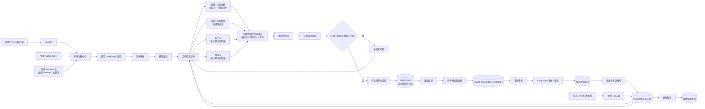
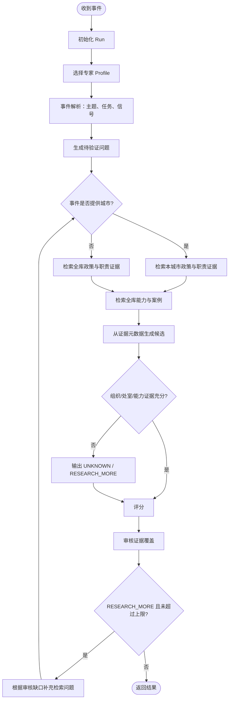
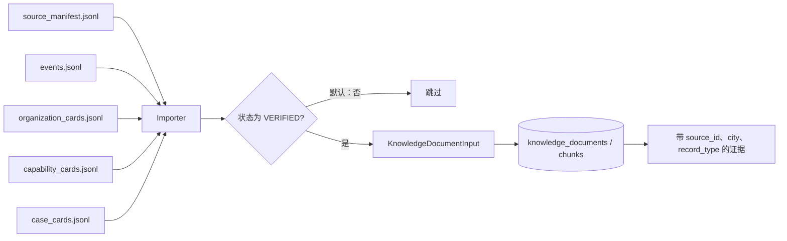

# Expert Engine 架构演进

本文是每次架构或核心流程变更的审阅基线。后续开发完成后，必须同步更新本页的“当前架构”“当前流程”和“演进记录”，并在交付说明中附上对应 Mermaid 图。

## 组件边界

1. `app/nodes/core.py` 只负责编排与基于证据的推断，禁止内置任何城市、单位、处室、能力或案例 ID/名称作为业务结论。
2. 行业分类、评分权重等通用规则必须集中配置并可版本化；业务事实只来自知识库证据。
3. 缺少充分证据时，返回 `UNKNOWN` 或 `RESEARCH_MORE`，不得用默认实体补全。
4. 每个数据导入记录必须保留原始 `source_id` 与可追溯元数据。

## 目标技术架构与当前进度

状态口径：**已完成**表示已有可验证实现；**部分完成**表示基础实现可用但未达到目标技术形态；**未开始**表示尚无对应功能。

```mermaid
flowchart LR
    Event[事件] --> Research[Research]
    Research --> Reason[Expert Reasoning]
    Reason --> Ground[Evidence Grounding]
    Ground --> Business[商务判断]
    Business --> Reviewer[Reviewer]
    Reviewer --> Practice[人工实践]
    Practice --> Feedback[反馈]
    Feedback --> Candidate[Knowledge Candidate]
    Candidate --> Approval[专家审核]
    Approval --> Knowledge[Expert Knowledge]
    Knowledge --> Research

    classDef done fill:#2e7d32,color:#fff,stroke:#1b5e20;
    classDef partial fill:#f9a825,color:#111,stroke:#c17900;
    classDef planned fill:#757575,color:#fff,stroke:#555;
    class Event done;
    class Research,Reason,Ground,Business,Reviewer partial;
    class Practice,Feedback,Candidate,Approval,Knowledge partial;
```

| 步骤 | 目标主要方法 | 是否用大模型 | 目标核心技术 | 当前进度 |
| --- | --- | --- | --- | --- |
| 事件 | 事件接入 + 标准化 | 是 | LangGraph Node + LLM Structured Output | **部分完成**：支持结构化输出和规则降级，LLM 默认关闭。 |
| Research | 多源检索与研究 | 是 | Hybrid RAG + SQL + BM25 + Vector + Web/内部库 | **部分完成**：PostgreSQL 关键词、城市/主题过滤、研究规划；未接向量、BM25、Web、内部库。 |
| Expert Reasoning | 专家推理 | 是，核心 | LLM + Expert Profile + Rules + Case Memory | **部分完成**：Profile、Runtime、受约束 LLM 需求推理、规则、案例匹配已具备；候选匹配仍以确定性规则为主。 |
| Evidence Grounding | 证据绑定与校验 | 少量 | Evidence Engine + Rerank + Citation Mapping | **部分完成**：证据 ID、来源 URL、结论—证据映射、chunk 级引用、确定性 rerank、缺口审核已具备。 |
| 商务判断 | 结构化综合判断 | 是 | LLM Synthesis + 确定性评分 | **部分完成**：已支持 Schema 约束 LLM 综合判断与确定性评分；未配置模型时规则模板兜底。 |
| Reviewer | 独立反审 | 是 | Critic LLM + Rules + Conditional Routing | **部分完成**：规则审核、可选 Critic LLM、条件路由、一次补检索完成。 |
| 人工实践 | 商务实际执行 | 否 | Dify/Web/CRM | **部分完成**：已有通用人工审核 API 和审计记录；未接 Dify/Web/CRM。 |
| 反馈 | 结构化结果记录 | 可辅助 | Form + LLM 信息抽取 | **部分完成**：已有通用反馈 API 与审计表；未接表单界面和 LLM 信息抽取。 |
| Knowledge Candidate | 经验提炼 | 是 | LLM Knowledge Extraction | **部分完成**：反馈驱动的候选提炼、来源反馈快照、待审核持久化与查询 API 已具备；尚未接入专家审批。 |
| 专家审核 | 人工审批 | 否为主 | LangGraph Interrupt / HITL | **部分完成**：可审核分析 Run 和知识候选，并审计通过/驳回决定；候选审核采用 PostgreSQL checkpoint 的 LangGraph Interrupt。 |
| Expert Knowledge | 正式知识发布 | 否 | PostgreSQL + pgvector + 版本治理 | **部分完成**：审核通过候选可事务式发布到 PostgreSQL 知识文档，具备递增版本、候选来源追溯与安全退役；未接 pgvector、版本恢复。 |
| 下一次推理 | 检索历史经验再推理 | 是 | Expert Knowledge Retrieval + LangGraph | **部分完成**：Research 已检索已发布 `INTERNAL` 专家知识作为补充上下文；尚未实现向量检索与经验效果评测。 |

### 当前实际运行链路

```mermaid
flowchart LR
    Input[事件输入] --> Parse[事件解析]
    Parse --> Plan[研究规划]
    Plan --> Search[定向检索]
    Search --> Match[证据驱动匹配与排序]
    Match --> Ground[结论—证据映射]
    Ground --> Score[商务评分与判断]
    Score --> Review[规则 Reviewer]
    Review -->|证据不足，最多一次| Search
    Review -->|完成或仍有缺口| Store[(expert_runs)]
    Store --> Human[人工审核 API]
    Human --> Audit[(expert_run_reviews)]
    Store --> Feedback[跟进反馈 API]
    Feedback --> FeedbackStore[(expert_run_feedback)]
    FeedbackStore --> Candidate[候选提炼 API]
    Candidate --> CandidateStore[(expert_knowledge_candidates<br/>PENDING_APPROVAL)]
    CandidateStore --> CandidateReview[专家审核 API]
    CandidateReview --> HITL[LangGraph Interrupt / Resume]
    HITL --> CandidateAudit[(expert_knowledge_candidate_reviews)]
    CandidateAudit --> Publish[正式发布 API]
    Publish --> Published[(knowledge_documents<br/>INTERNAL expert knowledge)]
    Published --> Retire[版本退役 API]
    Retire --> RevisionAudit[(publication revisions)]
```

> 更新约定：每次核心开发完成后，必须同步更新本表的“当前进度”、上方目标流程图的状态颜色、当前实际运行链路及“演进记录”。

## 当前架构

## 当前分析流程

## 数据流

## 演进记录

### 2026-08-27 — 数据驱动匹配与定向检索

- 移除节点中固定的单位、处室、能力、案例业务结论。
- 将组织、处室、能力和案例候选改为从检索证据元数据生成。
- 事件支持 `city`；本地政策和职责检索按城市过滤。
- 引入城市 JSONL 预检与导入器；正式导入默认仅接纳 `VERIFIED`。
- 已验证：测试 11 项通过，种子 benchmark 通过。

### 2026-08-27 — 受控补检索闭环

- Reviewer 在缺政策或处室证据时，将缺口转为补检索问题并回到研究步骤。
- `MAX_RESEARCH_RETRIES` 控制重试次数，默认 1 次，避免无界循环。
- 达到上限后保留 `RESEARCH_MORE` 和缺口信息返回，不将不充分结论伪装为确认结论。

### 2026-08-27 — 专家注册中心

- Graph 通过注册中心解析专家，不再直接引用住建专家 ID、Prompt 或主题词。
- Profile 声明默认专家与 Runtime 模块；Runtime 承载该行业的规则和 Prompt。
- 新行业仅需新增 Profile 与 Runtime 包，不需修改通用 Graph 编排代码。

### 2026-08-27 — 运行结果持久化

- API 不再直接维护进程内 `_runs`；通过 `RunRepository` 抽象保存与读取结果。
- 部署使用 PostgreSQL `expert_runs` 表，服务重启后仍可查询；测试使用内存实现。
- 分析审核通过保存为 `COMPLETED`，否则保存为 `PENDING_REVIEW`，为后续人工审核操作预留状态。

### 2026-08-27 — 检索上下文化

- 研究检索同时使用研究问题、事件标题和运行时识别出的主题，提升中文关键词基线的可命中性。
- 政策/行业证据按城市和主题筛选；能力/案例按主题全库筛选；组织职责仅按城市筛选。
- 排序继续以命中项、来源可靠度、生效日期和稳定文档 ID 决定，避免同分结果漂移。

### 2026-08-27 — 通用候选排序

- 组织、处室、能力、案例引用统一的证据排序组件。
- 排序只使用检索相关度、来源可靠度和可用的城市/主题元数据；没有元数据时降低上下文分，不补造事实。
- 同分以稳定 ID 排序，保障相同输入得到相同候选顺序。

### 2026-08-27 — 结论—证据映射

- 新增 `ground_evidence` 节点，统一生成需求、组织、处室、能力结论与其证据 ID 的映射。
- 每项映射明确标注 `GROUNDED` 或 `UNGROUNDED`，不把无依据候选伪装为已证实结论。
- API 响应新增 `grounding`，为人工审核与后续 Citation Mapping 提供稳定契约。

### 2026-08-27 — 人工审核审计基础

- 新增通用人工审核 API，可对已保存运行提交 `APPROVE`、`REJECT`、`REQUEST_RESEARCH` 决定。
- 审核人以角色代号和备注进入 `expert_run_reviews` 审计表，避免业务节点硬编码审批人或组织。
- 当前仅记录审核决定；下一阶段可将 `REQUEST_RESEARCH` 与 LangGraph Interrupt/恢复执行连接。

### 2026-08-27 — 受约束 LLM 商务综合判断

- 商务判断节点可调用专家 Runtime 声明的 `opportunity_synthesis` 模型，输入仅包含已接地的分析、候选和证据映射。
- 输出经过 `Opportunity` Schema 本地校验；模型未配置或校验失败时回退确定性摘要。
- Prompt 明确禁止补充项目、预算、职责、采购或案例事实，证据不足必须表现为风险项。

### 2026-08-27 — 可选 Critic LLM Reviewer

- Reviewer 在确定性政策/处室证据门槛之外，可调用独立 Critic LLM 审查结论—证据映射。
- Critic 只能增加缺口，不能移除确定性规则发现的问题；最终路由仍由本地规则控制。
- 未配置模型或输出不合规则，继续使用确定性 Reviewer。

### 2026-08-27 — Chunk 级引用映射

- `grounding` 中的每项结论新增引用列表，包含证据 ID、知识文档 ID、标题、来源 URL 与 chunk 索引。
- PostgreSQL 检索保留 chunk 索引，人工审核可直接定位支撑某项结论的文档片段。
- 未改变证据判断逻辑；引用只反映已检索、已绑定的真实来源。

### 2026-08-27 — 确定性 Evidence Rerank

- 检索结果在进入专家匹配前，按标题/正文词命中、初始检索相关度和来源可靠度融合重排。
- Rerank 为通用组件，不依赖城市、单位、产品或专家事实。
- 重排后的相关度作为候选排序输入；同分按可靠度和稳定证据 ID 决定顺序。

### 2026-08-27 — 受约束 LLM 需求推理

- `infer_needs` 可调用专家 Runtime 的 Schema 约束模型，只接收事件分析和政策/行业证据。
- 模型产生的证据 ID 在本地过滤，未知 ID 会移除并降低置信度。
- 规则兜底的需求 ID 由主题和任务稳定派生，不再使用固定业务样例 ID。

### 2026-08-27 — 跟进反馈基础

- 新增反馈 API，用通用 outcome、notes、submitted_by 字段记录实际跟进结果。
- 反馈写入 `expert_run_feedback`，与运行结果关联但不修改原始研判结论。
- 后续 Knowledge Candidate 将从经权限控制的反馈记录中提炼候选经验。

### 2026-08-27 — Knowledge Candidate 候选提炼

- 仅对已有实践反馈的 Run 提炼候选；没有反馈时 API 返回冲突，不将分析结果误当作实践经验。
- 候选保存关联 Run、反馈 ID 快照、支撑证据 ID 与 `PENDING_APPROVAL` 状态，尚不会进入正式知识库或影响下一次检索。
- 提炼支持专家 Runtime 声明的 Schema 约束 LLM；未配置或输出不合规时，以明确标注“待审核”的确定性摘要兜底。

### 2026-08-27 — Knowledge Candidate 专家审核

- 新增候选专家审核 API，仅允许 `PENDING_APPROVAL` 候选被通过或驳回一次，避免后续决定覆盖既有审核结论。
- 每次审核保存审核人角色代号、备注、决定及时间；候选状态变为 `APPROVED` 或 `REJECTED`。
- 审核通过仍不等于发布：正式知识库写入与版本治理留给下一步发布节点。

### 2026-08-27 — 候选审核 LangGraph HITL 编排

- 候选创建完成后启动独立审核 Graph，并在 `interrupt` 节点暂停；审核 API 使用候选 ID 对应的线程以 `Command(resume=...)` 恢复。
- 恢复后的 Graph 本地校验专家输入，再写入候选状态与审核审计；自动系统不会替代专家作出批准结论。
- 使用官方 LangGraph PostgreSQL checkpointer，待审 workflow 状态与审核结果均可跨进程恢复。
- `scripts.migrate` 同时执行官方 checkpoint schema 初始化；测试环境显式使用内存 checkpointer，避免依赖开发者本地数据库。

### 2026-08-27 — Expert Knowledge 正式发布

- 仅 `APPROVED` 候选可发布；发布后状态变为 `PUBLISHED`，待审或驳回候选不会写入知识库。
- 发布在同一 PostgreSQL 事务内写入 `knowledge_documents`、chunk 与 `expert_knowledge_publications`；发布记录保存候选来源、专家 ID 与递增版本。
- Research 新增 `INTERNAL` 补充检索，使已发布经验可供后续推理参考，但不会替代政策或处室职责等主证据。

### 2026-08-27 — Expert Knowledge 安全退役

- 已发布知识可由专家安全退役：不删除候选、文档或发布记录，只将版本状态变为 `RETIRED` 并记录原因。
- 退役文档在检索层被排除，避免旧经验继续影响下一次推理；数据库中仍保留完整可追溯历史。
- 每个版本只能退役一次，避免重复治理动作覆盖审计链路。
