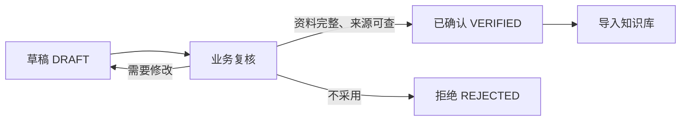
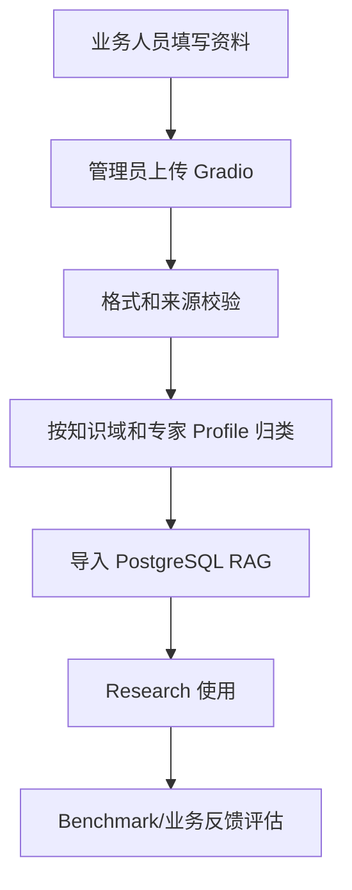

# 业务数据收集指南（非技术版）

## 这份资料是做什么的

我们要收集的是“专家分析时可以参考的事实”，不是让业务人员填写系统答案。业务人员只需要回答三件事：

1. 发生了什么？
2. 哪个单位/部门负责？
3. 有没有公开政策、案例或能力材料可以证明？

系统会根据这些资料做 Research、匹配和证据引用。业务人员不需要理解向量、RAG、Embedding 或数据库。

## 推荐文件夹

```text
<专家名称>-<城市>-<批次>/
├── 01_来源材料/              # 原文 PDF、网页存档、公告截图
├── 02_事件线索/              # 发生了哪些政策、项目、采购或新闻
├── 03_组织职责/              # 单位和处室分别负责什么
├── 04_我方能力/              # 我方能做什么（需脱敏）
├── 05_历史案例/              # 已授权或公开的项目经验（需脱敏）
├── 06_专家评测样本/          # 业务专家确认的标准答案，可后补
└── 00_提交说明.md            # 填写人、时间、专家 Profile、未确认事项
```

## 每类资料怎么填

### 1. 来源材料

先保存原文，再填写一行来源登记。文件名建议使用：

```text
src_<城市或范围>_<年份>_<序号>.pdf
```

| 要填什么 | 示例 |
| --- | --- |
| 来源标题 | 重庆城市生命线建设实施方案 |
| 来源类型 | 政策 / 职责 / 新闻 / 采购 / 案例 / 企业材料 |
| 发布单位 | 重庆市人民政府 |
| 发布日期 | 2025-05-16 |
| 链接 | 官方网页地址 |
| 文件名 | `01_来源材料/src_cq_2025_005.pdf` |
| 是否确认 | 是 / 否 |

不要只发摘要。系统需要保留原文，摘要只是帮助理解。

### 2. 事件线索

一行代表一个值得分析的事件。

| 事件标题 | 发生了什么 | 城市 | 主题 | 来源编号 | 状态 |
| --- | --- | --- | --- | --- | --- |
| 重庆推进管线数字孪生建设 | 已归集管线数据并建设监测预警能力 | 重庆 | 城市生命线、住建数据治理 | `src_cq_2025_005` | 草稿 |

填写原则：只写来源中明确出现的内容；不确定的部门、预算和项目阶段写“待确认”。

### 3. 组织职责

一行代表一个单位或一个处室。

| 单位/处室 | 可能承担的角色 | 有来源证明的职责 | 来源编号 | 确认情况 |
| --- | --- | --- | --- | --- |
| 重庆市住房城乡建设委员会 | 政策统筹 | 统筹城市基础设施建设 | `src_cq_2025_001` | 已确认 |
| 城市提升统筹处 | 牵头/协同 | 统筹城市提升工作 | `src_cq_2025_009` | 待业务复核 |

不要根据单位名称猜职责；没有直接证据就写“未知”。

### 4. 我方能力

只填写可以公开或内部授权使用的能力，不能填写客户机密。

| 能力名称 | 能解决什么问题 | 适用主题 | 证明材料 | 是否可对外使用 |
| --- | --- | --- | --- | --- |
| 城市生命线监测预警 | 感知接入、异常告警、运行可视化 | 城市生命线、燃气安全 | `src_company_002` | 是 |

### 5. 历史案例

一行代表一个已授权或公开的案例。

| 案例名称 | 客户类型/城市 | 做了什么 | 结果 | 对应能力 | 证明材料 |
| --- | --- | --- | --- | --- | --- |
| 某直辖市智慧燃气上云项目 | 城市治理 / 天津 | 建设燃气监测平台 | 支撑业务上线和异常处置 | 城市生命线监测预警 | `src_company_002` |

禁止填写客户姓名、手机号、合同金额、账号密钥和未授权内部细节。

### 6. 专家评测样本（可后补）

这不是普通资料，而是“专家认为系统应该怎么判断”的标准案例。

| 事件 | 正确主题 | 应关注需求 | 正确组织/处室 | 必须有的证据 | Reviewer 结论 |
| --- | --- | --- | --- | --- | --- |
| 城市生命线实施方案 | 城市生命线 | 监测预警平台 | 住建委/城市建设处 | 政策、职责、案例 | 通过 |

## 状态怎么理解



- `DRAFT`：可以继续修改，不能作为正式知识。
- `VERIFIED`：业务人员确认过，允许导入系统。
- `REJECTED`：不采用，但保留原因，避免重复采集。

## 提交前检查

- [ ] 每条事件都有来源编号。
- [ ] 每个组织/处室职责都有来源依据。
- [ ] 能力和案例已经脱敏并确认可使用。
- [ ] 不确定的信息写“待确认”，没有自行补全。
- [ ] 原文材料已放入 `01_来源材料`。
- [ ] 业务负责人完成复核，状态改为 `VERIFIED`。
- [ ] 在 `00_提交说明.md` 中写清城市、专家 Profile、批次和联系人角色。

## 交给管理员后会发生什么



当前系统已经支持 JSONL 导入；如果业务人员使用 Excel 或表格收集，管理员先按现有模板转换，后续会增加 Excel/CSV 直接导入能力。

## 可直接参考的示例包

请先查看 [`example-package/`](example-package/)，其中的 CSV 文件可以直接用 Excel 打开，配套的 `00_提交说明.md` 展示了业务提交时需要说明的内容。示例数据仅用于理解填写方式，正式导入前必须重新核验来源并将状态改为 `VERIFIED`。
