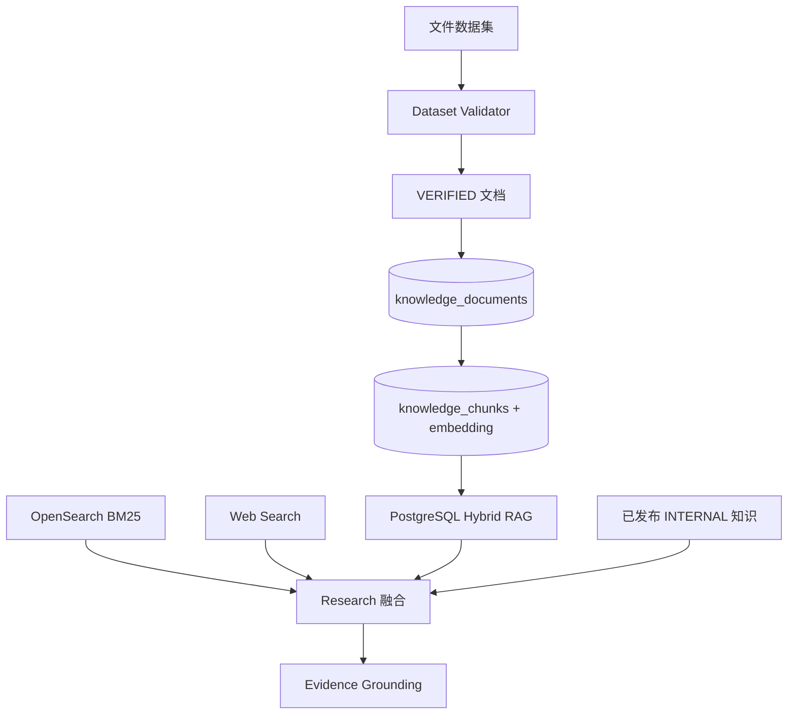
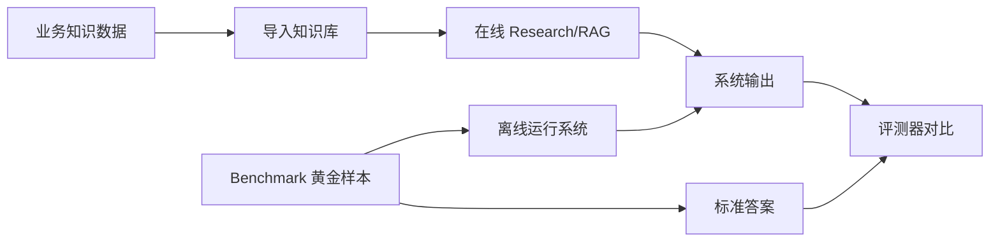

# 数据存储与使用说明

当前系统采用“文件数据集 + PostgreSQL 统一知识库 + 运行/评测数据分离”的结构。政策、组织、能力、案例等是不同知识域，不代表必须使用不同物理数据库。

## 总表

| 数据 | 文件/表位置 | 核心字段 | 是否进入 RAG | 使用阶段 | 作用 |
| --- | --- | --- | --- | --- | --- |
| 来源清单 | `docs/data-collection/chongqing/source_manifest.jsonl` | `source_id`、来源类型、URL、状态 | 间接 | 导入前校验 | 记录原始来源和可追溯信息 |
| 事件数据 | `events.jsonl` | `event_id`、标题、正文、城市、主题 | 通常不作为长期知识 | Event / Research | 作为一次分析的输入事件 |
| 组织职责数据 | `organization_cards.jsonl` | 组织、处室、职责、`evidence_ids` | 是 | Research / 组织匹配 | 判断主管组织和处室职责 |
| 能力数据 | `capability_cards.jsonl` | 能力名称、描述、适用主题、`evidence_ids` | 是 | Research / 能力匹配 | 判断能力是否适配需求 |
| 案例数据 | `case_cards.jsonl` | 案例、城市、主题、交付能力、结果 | 是 | Research / 案例匹配 | 提供相似项目和落地依据 |
| 政策/行业来源 | 由 `source_manifest` + 事件/卡片转换 | `source_type=POLICY/INDUSTRY` | 是 | Research / Need Reasoning | 提供政策和行业事实依据 |
| 内部专家知识 | `knowledge_documents`，`source_type=INTERNAL` | 发布版本、状态、专家 ID | 是，但作为补充 | 历史经验检索 | 参与下一次推理，不能替代政策/职责证据 |
| 知识正文与片段 | PostgreSQL `knowledge_documents` + `knowledge_chunks` | `document_id`、`chunk_id`、正文、来源、metadata | 是 | Research | RAG 的实际检索载体 |
| 向量 | `knowledge_chunks.embedding` | 向量、`embedding_model` | 是 | Vector Search | 语义相似度检索 |
| BM25/Web 结果 | 外部 OpenSearch/Web endpoint | URL、标题、摘要、分数 | 不落库（当前） | Research | 临时补充外部证据，保留引用 URL |
| Benchmark 黄金样本 | `evaluation/benchmark_*.json` | 事件 + `expected` 标准答案 | 否（默认） | 离线评测 | 评价系统输出质量，不参与在线推理 |
| 重庆标注草稿 | `benchmark_labels.jsonl` | 期望主题、组织、证据、状态 | 否（默认） | 样本准备/评测 | `DRAFT` 等人工确认后再转为黄金样本 |
| 分析运行结果 | PostgreSQL `expert_runs` | `run_id`、`expert_id`、result、状态 | 否 | API / 审计 | 保存一次完整分析输出 |
| 人工反馈 | `expert_run_feedback` | 结果、备注、提交人 | 否 | 人工实践后 | 生成 Knowledge Candidate 的输入 |
| 知识候选 | `expert_knowledge_candidates` | 候选内容、来源反馈、状态 | 尚未发布时否 | Knowledge Candidate / 审核 | 等待专家审核的经验提炼结果 |
| 正式专家知识 | `expert_knowledge_publications` + 知识表 | 专家、版本、发布状态 | 是 | 下一次 Research | 经过审核后进入内部知识检索 |

## RAG 到底使用哪些数据

RAG 不是单独的一张表，而是一种检索方式：先从知识文档和片段中召回内容，再把召回结果交给后续推理。当前 Research 会按 `POLICY`、`RESPONSIBILITY`、`CAPABILITY`、`CASE`、`INTERNAL` 等类型分开检索。

## Benchmark 和业务数据的边界

- 业务知识数据回答“系统应该参考什么事实”。
- Benchmark 回答“系统输出得是否正确”。
- Benchmark 默认不进入知识库，也不发送给在线大模型。
- 只有明确挑选为 Prompt Example 的案例，才会作为少量示例进入 Prompt。

## 当前最重要的管理原则

1. Admin 上传时选择知识域和专家 Profile。
2. `DRAFT` 只保留在文件层，`VERIFIED` 才允许导入知识库。
3. 导入后的不同知识域通过 `source_type` 区分，内部知识通过 `INTERNAL` 和发布状态隔离。
4. 事件是分析输入，不等于长期知识；Benchmark 是评测标准，不等于 RAG 数据。
5. 原始来源通过 `source_id`、URL、metadata 与知识片段保持关联。
