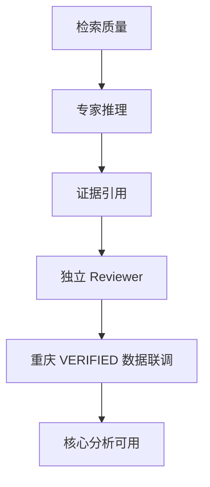

# Expert Engine 开发计划

本计划以“重庆住建数字化首轮可用分析模块”为近期里程碑。进度状态与完整流程图见 [架构演进](architecture.md)；每完成一项核心能力，本文件、架构进度表和演进记录必须一起更新。

## 里程碑路线

| 阶段 | 目标 | 关键交付 | 完成标准 | 当前状态 |
| --- | --- | --- | --- | --- |
| 0. 可控分析底座 | 跑通可追溯分析链路 | 专家注册、定向检索、规则推断、Reviewer、Run 持久化、人工审核基础 | API/测试/种子 benchmark 可稳定运行，节点无业务实体硬编码 | **已完成** |
| 1. 核心分析可用 | 让真实城市数据得到可靠、可解释的判断 | 混合检索、LLM 受约束推理与综合判断、Critic Reviewer、片段级引用 | 用重庆 `VERIFIED` 数据通过人工抽检；25–30 条事件可重复分析 | **进行中** |
| 2. 人工实践与反馈 | 将真实商务跟进结果结构化回流 | 审核工作台/API、行动/结果表单、反馈抽取 | 每条人工决定与跟进结果可审计、可查询 | **进行中**：审核与反馈 API 已具备。 |
| 3. 知识学习闭环 | 将经审批经验发布为专家知识 | Knowledge Candidate、HITL 审批、版本治理、知识发布 | 候选知识可审批、回滚，并参与后续检索 | **进行中**：候选提炼、待审持久化与专家审核已完成。 |
| 4. 重庆试点验收 | 验证可用性和发布门槛 | 50–100 条黄金标注、评测报告、运行手册 | 达到业务确认的准确率/证据覆盖/稳定性门槛 | **未开始** |

## 阶段 1 当前拆解

1. 检索质量：接入向量检索、BM25/全文检索与融合排序；保留当前 SQL 元数据过滤。
2. 专家推理：需求推理、商务综合判断已接入 Schema 约束 LLM；后续将候选匹配接入 Schema 约束 LLM，并保持规则/证据校验兜底。
3. 证据引用：已升级到文档 chunk、来源链接、定位信息与确定性 rerank；后续补充原文件归档定位。
4. 独立 Reviewer：已接入可选 Critic LLM，对结论与映射证据进行独立审查；后续补充真实数据下的评测与校准。
5. 数据联调：仅使用 `VERIFIED` 重庆资料；把人工反馈转为 benchmark 样本和规则调整依据。

## 代码可读性约定

- 每个类必须包含一句简短 docstring，说明它的职责。
- 公共函数和存在非显然控制流的函数必须包含 docstring；关键安全、兼容或路由决策可补一行注释。
- 注释解释“为什么”，不复述代码本身。
- 业务事实不写入节点、类或配置常量；使用 Profile、规则版本或知识库记录。
